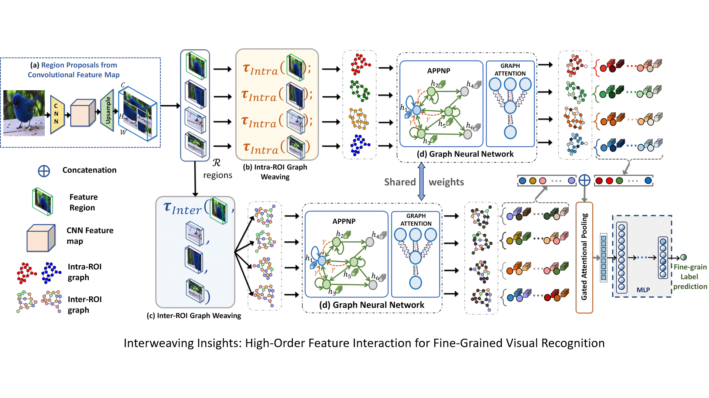

## I2-HOFI
The official source code for *"Interweaving Insights: High-Order Feature Interaction for Fine-Grained Visual Classification (FGVC)"*, implementing advanced FGVC with high-order feature interactions through Graph Neural Networks (GNNs).



## Introduction
This repository provides the implementation of **I2-HOFI** (Inter and Intra-region High-Order Feature Interaction), a hybrid **CNN-GNN** model designed for **Fine-Grained Visual Classification (FGVC)**. I2-HOFI uses **Graph Neural Networks (GNNs)** to model complex high-order feature interactions within and across regions of interest in an image. The model builds **inter- and intra-region graphs** to capture both local and global visual relationships through a shared GNN. Inter-region graphs handle long-range dependencies for global pattern recognition, while intra-region graphs focus on nuanced details within regions, enabling I2-HOFI to achieve state-of-the-art results on FGVC benchmarks.


### Link to the Paper
You can access the full paper here : [Interweaving Insights: High-Order Feature Interaction for Fine-Grained Visual Recognition](https://link.springer.com/article/10.1007/s11263-024-02260-y)

### Upcoming Updates
We're preparing to release several enhancements soon:
- Pre-trained model weights trained on different the datasets to facilitate result reproduction.
- An inference script for reproducing the results.
- Releasing t-SNE plotting code for visualization and analysis of model outputs.

## Installation Guide

### Prerequisites
Ensure you have Python 3.9+ installed on your system. You can download it from [Python's official website](https://www.python.org/downloads/).

### Virtual Environment Setup (Recommended)
For setting up a virtual environment, we recommend using [Anaconda](https://www.anaconda.com/download) to manage dependencies efficiently. Anaconda simplifies the process of creating isolated environments through `conda` and ensures compatibility across packages. To get started, run the following commands in your console:

--------------------------
#### Installation on Linux
- **Create and activate a new Conda environment:**
   ```bash
   conda create -n myenv python=3.9
   conda activate myenv
   ```

- **Install TensorFlow with CUDA support (if using GPU):**
   ```bash
   pip install tensorflow==2.12.1
   ```

-  **Verify the TensorFlow installation with CUDA support:**
   ```bash
   python3 -c "import tensorflow as tf; print(tf.config.list_physical_devices('GPU'))"
   ```
   If the tensorflow is not able to detect CUDA devices try perform this optional installation:
   ```bash
   pip install cuda-python
   ```
------------------
#### Installation on Windows

- **Create a new Conda environment with basic packages from the Anaconda channel:**
   ```bash
   conda create -n myenv anaconda python=3.9
   ```

- **Activate the Conda environment:**
   ```bash
   conda activate myenv
   ```

- **Install GPU support packages:**
   ```bash
   conda install -c conda-forge cudatoolkit=11.2 cudnn=8.1.0
   ```

- **Install TensorFlow (version compatibility with GPU on Windows):**
   Note:  TensorFlow versions above 2.10 are not natively supported on GPUs in Windows. For more details, refer to the official [TensorFlow installation guide for Windows](https://www.tensorflow.org/install/pip#windows-native).
   ```bash
   python -m pip install "tensorflow<2.11"
   ```

- **Verify TensorFlow installation with GPU support:**
   ```bash
   python -c "import tensorflow as tf; print(tf.config.list_physical_devices('GPU'))"
   ```
--------------------------

- **Install other necessary packages:**
   ```bash
      pip install opencv-python
      pip install spektral
      pip install wandb
   ```
   
This setup will prepare your environment with the necessary libraries to run the project. Please ensure that TensorFlow with CUDA support is correctly installed. 
- If you encounter issues installing TensorFlow with CUDA, which may occur due to hardware differences, please refer to the official [TensorFlow installation guide](https://www.tensorflow.org/install/pip) for detailed instructions. We recommend installing a specific version of TensorFlow to prevent compatibility issues, as newer versions may introduce changes that could lead to errors in our code. For optimal performance, a GPU with a minimum of 16GB of VRAM (dedicated memory) is recommended.

- It's also recommended to use Weights & Biases (WandB) for tracking metrics such as training and validation accuracy. Start by creating a WandB account and obtaining your API key following [quickstart guide](https://docs.wandb.ai/quickstart). In the `./configs/config_<dataset_name>.yaml` file, locate the following line:

```bash
API_key: "########## REPLACE THIS STRING WITH YOUR WandB API HASH KEY ########"
```
Replace the string `"########## REPLACE THIS STRING WITH YOUR WandB API HASH KEY ########"` with your actual API key to enable WandB integration.

### Usage of Script
For dataset preparation, please refer to [DATASET.md](datasets/DATASET.md). For training and inference instructions, see [GETTING_STARTED.md](GETTING_STARTED.md).

### Citing This Paper
If you find this work useful in your research, please consider citing it using the following BibTeX entry:

```BibTeX
@article{sikdar2024interweaving,
  title={Interweaving Insights: High-Order Feature Interaction for Fine-Grained Visual Recognition},
  author={Sikdar, Arindam and Liu, Yonghuai and Kedarisetty, Siddhardha and Zhao, Yitian and Ahmed, Amr and Behera, Ardhendu},
  journal={International Journal of Computer Vision},
  pages={1--25},
  year={2024},
  publisher={Springer}
}
```
